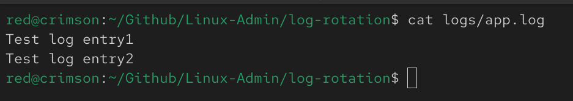
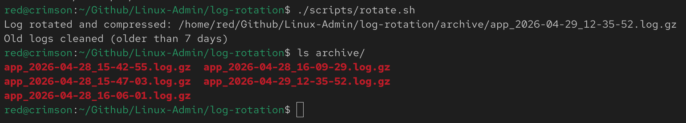
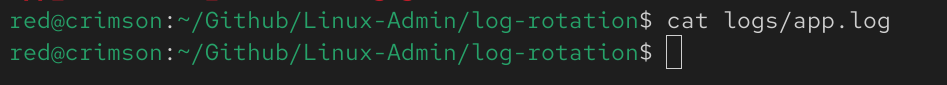
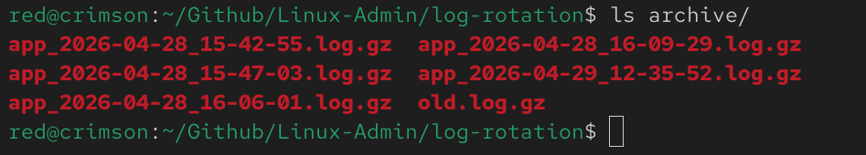
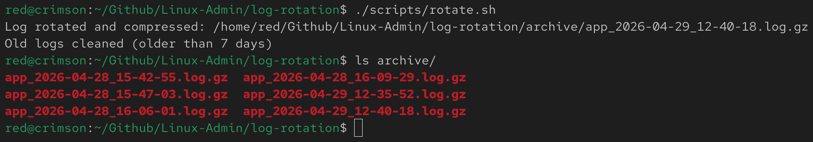

# Log Rotation & Cleanup Automation

## 📌 Overview

This project simulates a real-world system administration task of managing continuously growing log files.

It demonstrates how to rotate logs, compress them, enforce retention policies, and automate the process using cron.

---

## 🎯 Objectives

* Rotate active logs
* Compress archived logs
* Maintain log history
* Automatically delete old logs
* Automate using cron

---

## ⚙️ Features

* Log rotation using `mv`
* Compression using `gzip`
* Retention policy using `find`
* Timestamp-based log naming
* Automated execution using cron

---

## 📂 Project Structure

```
log-rotation/
├── scripts/rotate.sh
├── logs/app.log
├── archive/
├── screenshots/
└── README.md
```

---

## 🚀 How It Works

1. Active log (`app.log`) is moved to archive directory
2. Log file is renamed with timestamp
3. File is compressed using `gzip`
4. New empty `app.log` is created
5. Logs older than 7 days are deleted

---

## ⏱️ Automation

Cron job used:

```
0 * * * * /home/red/Github/Linux-Admin/log-rotation/scripts/rotate.sh
```

---

## 📸 Screenshots

### Before Rotation



### After Rotation



### New Log Created



### Cleanup Before



### Cleanup After



---

## 🧠 Key Learnings

* Log management in Linux systems
* File compression and archival
* Retention policies using `find`
* Automation using cron
* Importance of disk space management

---

## ⚠️ Notes

* Uses absolute paths for cron compatibility
* Designed for simulation but reflects real-world behavior
* Log files are excluded using `.gitignore`

