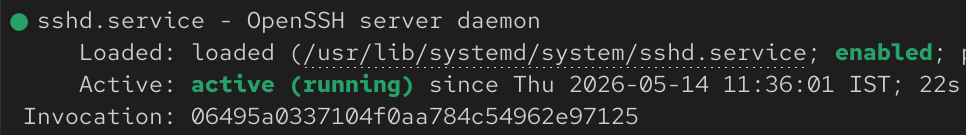
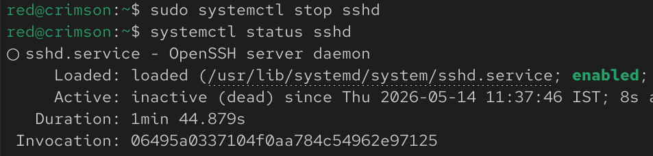
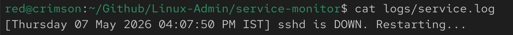
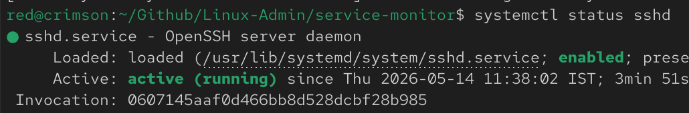
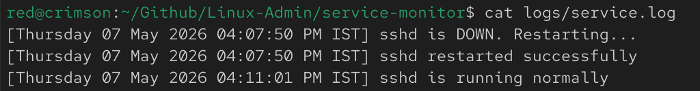
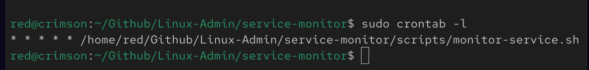

# Service Monitoring & Auto-Restart Automation

## 📌 Overview

This project simulates a real-world system administration scenario where critical services must be monitored continuously and automatically recovered if they fail.

The script checks whether the SSH service (`sshd`) is running. If the service goes down, it automatically restarts it and records the event in a log file.

---

## 🎯 Objectives

- Monitor service health
- Detect service failures
- Automatically restart failed services
- Maintain logs
- Automate checks using cron

---

## ⚙️ Features

- Service status check using `systemctl`
- Automatic restart using bash scripting
- Event logging
- Root cron automation
- Basic self-healing behavior

---

## 📂 Project Structure

```text
service-monitor/
├── scripts/monitor-service.sh
├── logs/service.log
├── screenshots/
└── README.md
```
---

## 🚀 How It Works
Script checks if sshd is active
If service is down:
Detects failure
Attempts restart
Logs action
If service is healthy:
Records normal state

---

## ⏱️ Automation

Configured using root cron:

* * * * * /home/red/Github/Linux-Admin/service-monitor/scripts/monitor-service.sh

This checks service status every minute.

---

## 📸 Proof

### Service Running Normally



---

### Service Stopped



---

### Failure Detection



---

### Service Restarted



---

### Log Output



---

### Root Cron Configuration



---

## 🧠 Key Learnings
Service monitoring fundamentals
Working with systemctl
Logging in shell scripts
Automating privileged tasks with root cron
Understanding self-healing concepts

---

## ⚠️ Notes
Root cron was used because restarting services requires elevated privileges
Scripts use absolute paths for cron compatibility
Designed as a simulation but follows real administration patterns


