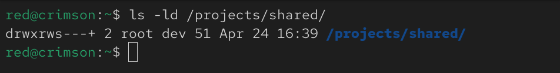
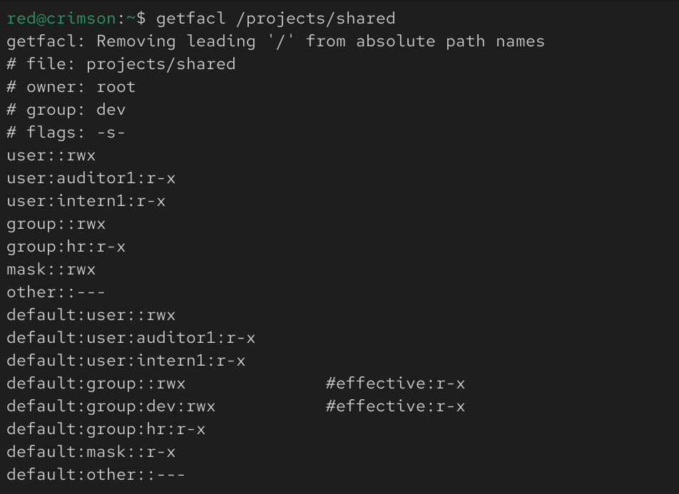
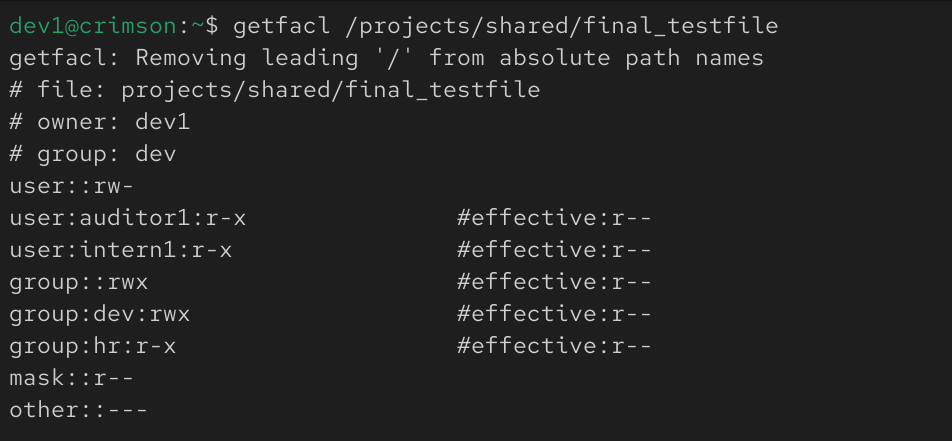
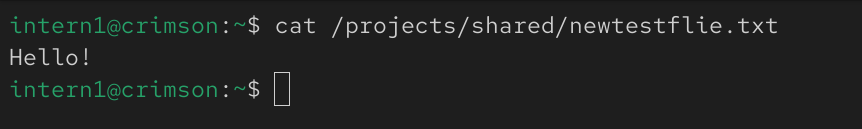
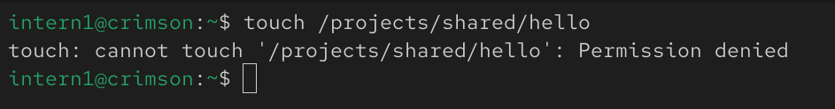

# Shared Access Control Lab

## 📌 Scenario
Simulated a shared enterprise workspace where multiple teams require controlled access to a common directory.

---

## 🎯 Objectives
- Enable collaboration for Dev team
- Provide read-only access to HR, Auditor, and Intern
- Prevent unauthorized modifications
- Ensure correct permission inheritance

---

## 🧱 Setup

### Directory
- /projects/shared

### Ownership
- Owner: root
- Group: dev

---

## 🔐 Access Design

| Role      | Access |
|----------|--------|
| Dev      | Full (rwx) |
| HR       | Read + Execute |
| Auditor  | Read + Execute |
| Intern   | Read + Execute |

---

## ⚙️ Key Concepts

- setgid → ensures group inheritance
- ACL → fine-grained access control
- Default ACL → inheritance for new files
- Mask → controls effective permissions

---

## 🧪 Validation

- Dev users can create and edit files
- HR/Auditor/Intern can:
  - Enter directory
  - List files
  - Read files
- Cannot modify or create files

---

## 🚀 Run

```bash
chmod +x scripts/setup.sh
sudo ./scripts/setup.sh 
```

---

## 📸 Proof of Implementation

### 1. Directory Permissions


### 2. ACL Configuration


### 3. Inheritance on New Files


### 4. Read Access (Intern)


### 5. Write Restriction (Intern)



## ⚠️ Note on Effective Permissions

Although ACL entries specify `r-x`, the effective permissions on files may appear as `r--`.

This is due to the system's umask (e.g., 0022), which removes execute permissions during file creation.

This behavior reflects real-world Linux systems where umask works alongside ACLs to enforce security.

