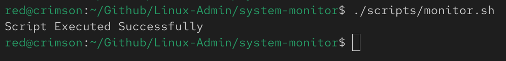
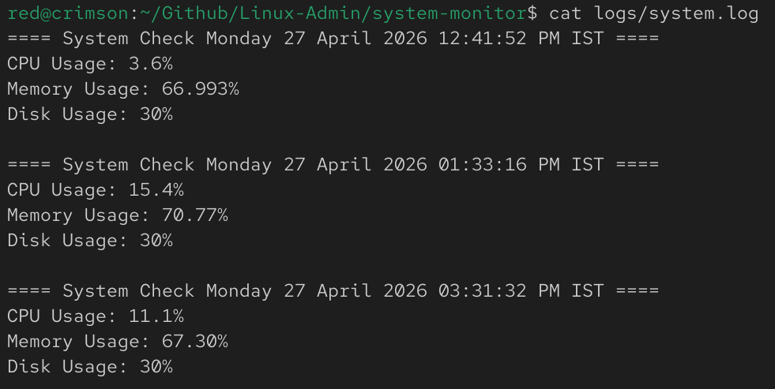

# System Monitoring & Alert Script

## 📌 Overview
This project simulates a real-world system administrator task of monitoring server resources and automating alerts.

---

## 🎯 Features

- CPU usage monitoring
- Memory usage tracking
- Disk usage monitoring
- Threshold-based alerts
- Logging system activity to file
- Automated execution using cron

---

## ⚙️ How It Works

The script collects system metrics using:

- `top` → CPU usage
- `free` → Memory usage
- `df` → Disk usage

If usage exceeds defined thresholds, alerts are logged.

---

## ⏱️ Automation

The script is scheduled using cron:

```bash
* * * * * /home/red/Github/Linux-Admin/system-monitor/scripts/monitor.sh
```
---

## 📸 Screenshots

### Script Execution


---

### Log File Output


---

### Cron Job Configuration


---

### Live Monitoring


---

## ⚠️ Notes
* system.log is excluded using .gitignore
* CPU calculation is approximate based on idle percentage
